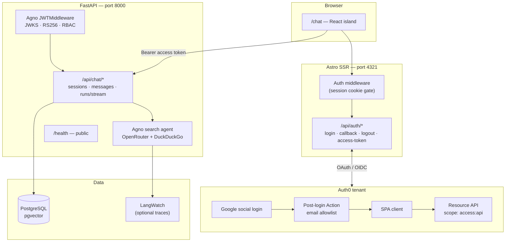

# web0personal-vector

Personal chat app with web search: an **Astro** frontend at `/chat`, a **FastAPI + Agno** backend with DuckDuckGo search, **PostgreSQL** session history, **Auth0** (Google login + JWT API protection), and optional **LangWatch** agent tracing. Deployed on **Railway** via local Makefile commands.

## Architecture



### Request flow

1. **Page load** — Astro middleware checks a signed session cookie (`AUTH0_SECRET`). Unauthenticated visitors are redirected to `/api/auth/login` (except auth routes, static assets, and `/api/auth/access-token`).
2. **Sign-in** — Auth routes use the Auth0 SDK (PKCE). After Google login, an Auth0 Action enforces the email allowlist; only allowlisted accounts receive tokens.
3. **Chat API** — The frontend fetches a short-lived access token from `/api/auth/access-token` and sends `Authorization: Bearer …` to the backend.
4. **Backend auth** — Agno `JWTMiddleware` validates JWTs against Auth0 JWKS (`RS256`, audience, `access:api` scope). `/health` is excluded. Identity is lazy-provisioned in Postgres on the first authenticated request.
5. **Agent run** — Messages trigger an Agno agent (OpenRouter model + DuckDuckGo tools). Responses stream over SSE; sessions and messages are stored per Auth0 `sub`.

### Components

| Layer | Stack | Role |
|-------|--------|------|
| Frontend | Node 22, TypeScript, Astro SSR, React (`ChatBox`) | Session gate, Auth0 login/logout, chat UI |
| Backend | Python 3.12, FastAPI, Agno, SQLAlchemy, Alembic | JWT-protected REST + SSE, agent orchestration |
| Database | PostgreSQL 16 + pgvector (Docker locally) | Users, chat sessions, messages, run metadata |
| Identity | Auth0 (Terraform in `infra/auth0-terraform`) | Google login, API audience, email allowlist Action |
| Observability | LangWatch + OpenInference (optional) | Agent trace export when `LANGWATCH_API_KEY` is set |
| Deploy | Railway CLI + Dockerfiles | Backend, frontend, and managed Postgres |

### Repository layout

```text
apps/
├── backend/          # FastAPI app (agentos_chat)
├── frontend/         # Astro SSR + /chat
└── playwright_e2e/   # E2E tests (optional)

infra/
├── auth0-terraform/  # Auth0 API, SPA, allowlist Action
└── railway/          # Provision, deploy, smoke scripts

specs/
├── 001-agentos-chat-search/
├── 002-langwatch-backend/
└── 003-auth0-integration/
```

## Prerequisites

- Python 3.12, Node.js 22, Make, Docker
- [OpenRouter](https://openrouter.ai/) API key (agent model)
- Auth0 tenant + Terraform M2M credentials (see below)
- Allowlisted Google account (see `infra/auth0-terraform/terraform.tfvars`)

## Quick start (local)

```bash
# 1. Environment
cp apps/backend/.env.example apps/backend/.env
cp apps/frontend/.env.example apps/frontend/.env
# Fill Auth0 + OPENROUTER_API_KEY — see Configuration

# 2. Auth0 (first time only)
cd infra/auth0-terraform && cp terraform.tfvars.example terraform.tfvars
# Edit tfvars, then: make init && make apply
# Map outputs into both .env files (table below)

# 3. Run stack
make install
make db-up
make migrate
make dev
```

| URL | Purpose |
|-----|---------|
| http://localhost:4321/chat | Chat UI (Auth0 sign-in required) |
| http://localhost:8000/health | Backend health (no auth) |

Local development always uses **real Auth0** (no mock identity).

## Configuration

### Backend (`apps/backend/.env`)

| Variable | Description |
|----------|-------------|
| `DATABASE_URL` | Async Postgres URL (default matches `docker compose`) |
| `AUTH0_DOMAIN` | Tenant domain, e.g. `your-tenant.us.auth0.com` |
| `AUTH0_ISSUER` | Issuer URL, e.g. `https://your-tenant.us.auth0.com/` |
| `AUTH0_API_AUDIENCE` | API identifier from Terraform |
| `CORS_ORIGINS` | Comma-separated origins (include `http://localhost:4321`) |
| `OPENROUTER_API_KEY` | Model provider key |
| `AGENT_MODEL` | OpenRouter model id (default in `.env.example`) |
| `LANGWATCH_API_KEY` | Optional — enable tracing |
| `LANGWATCH_ENDPOINT` | Optional LangWatch endpoint |
| `APP_ENVIRONMENT` | `local` \| `staging` \| `production` |

### Frontend (`apps/frontend/.env`)

| Variable | Description |
|----------|-------------|
| `PUBLIC_AUTH0_DOMAIN` | Same tenant domain as backend |
| `PUBLIC_AUTH0_CLIENT_ID` | SPA client id from Terraform |
| `PUBLIC_AUTH0_AUDIENCE` | Same API audience as backend |
| `PUBLIC_AGENTOS_API_BASE_URL` | Backend URL, e.g. `http://localhost:8000` |
| `AUTH0_SECRET` | Random 32+ char string for signed session cookies |

### Terraform outputs → `.env`

| Terraform output | Backend | Frontend |
|------------------|---------|----------|
| `auth0_domain` | `AUTH0_DOMAIN` | `PUBLIC_AUTH0_DOMAIN` |
| `issuer` | `AUTH0_ISSUER` | — |
| `api_audience` | `AUTH0_API_AUDIENCE` | `PUBLIC_AUTH0_AUDIENCE` |
| `spa_client_id` | — | `PUBLIC_AUTH0_CLIENT_ID` |

Details: [infra/auth0-terraform/README.md](infra/auth0-terraform/README.md), [specs/003-auth0-integration/contracts/terraform-env-mapping.md](specs/003-auth0-integration/contracts/terraform-env-mapping.md).

## Commands

| Command | Description |
|---------|-------------|
| `make install` | Install backend and frontend dependencies |
| `make db-up` / `make db-down` | Start/stop local Postgres (pgvector) |
| `make migrate` | Apply Alembic migrations |
| `make dev` | Run backend (`:8000`) and frontend (`:4321`) |
| `make check` | Ruff, mypy, frontend typecheck |
| `make test` | Backend pytest + frontend unit tests |
| `make smoke-local` | HTTP smoke against local URLs |
| `make e2e-install` | Playwright + Chromium |
| `make e2e` | E2E tests (stack must be running) |

### Railway deployment

```bash
cp infra/railway/project.env.example infra/railway/project.env
# Set project id, service names, env sync keys

make railway-preflight   # railway CLI + jq
make railway-up          # provision Postgres + sync vars
make railway-deploy      # deploy backend + frontend
make railway-cleanup     # wire DB URL, URLs, smoke
make railway-smoke       # production HTTP checks
```

Production topology matches local: browser → Astro frontend → JWT backend → Postgres, with Auth0 for identity. See [infra/railway/README.md](infra/railway/README.md).

**Smoke expectations:** backend `/health` returns 2xx; frontend `/` may return 302/307 to Auth0 (counts as success).

## Verification

```bash
# Protected endpoint without token → 401
curl -s -o /dev/null -w "%{http_code}\n" http://localhost:8000/api/chat/sessions

# Health → 200
curl -s http://localhost:8000/health
```

Manual Auth0 flow: [specs/003-auth0-integration/quickstart.md](specs/003-auth0-integration/quickstart.md).

## Further reading

| Topic | Doc |
|-------|-----|
| Auth0 setup & verification | [specs/003-auth0-integration/quickstart.md](specs/003-auth0-integration/quickstart.md) |
| Chat search feature | [specs/001-agentos-chat-search/quickstart.md](specs/001-agentos-chat-search/quickstart.md) |
| LangWatch tracing | [specs/002-langwatch-backend/quickstart.md](specs/002-langwatch-backend/quickstart.md) |
| Railway ops | [infra/railway/README.md](infra/railway/README.md) |
